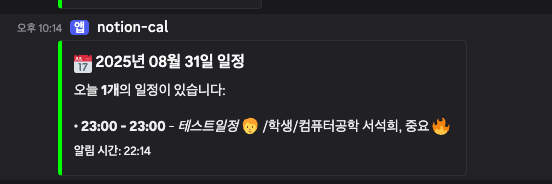
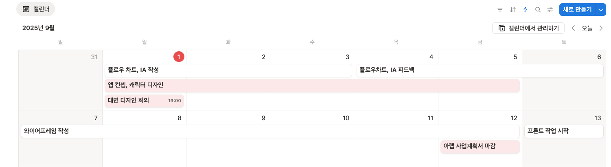
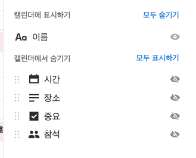

# 노션 캘린더 일정 확인 디스코드 알림봇

원래 존재하던 노션 todo 알림봇을 캘린더 일정 알림봇으로 수정했다.

origin : https://github.com/i-am-not-kangjik/free-notion-discord-alert-bot.git

## 결과물

## 예시 데이터베이스

- 

## 사용법

Fork 후 아래의 준비물 준비 후
github/workflows/notify.yml 파일의 cron 부분을 수정하여 알림 받을 시간 설정
(기본 오전 8시, UTC 기준이므로 알림받고자 하는 한국시간의 -9시간 설정)

## 준비물

1. Notion 캘린더 데이터베이스
2. Notion API KEY
3. Notion DATABASE ID
4. Discord Web Hook URL

## 준비물 준비 및 생성법

[Velog 게시글 링크](https://velog.io/@i-am-not-kangjik/%EB%AC%B4%EB%A3%8C-To-do-List-%EB%94%94%EC%8A%A4%EC%BD%94%EB%93%9C-%EC%95%8C%EB%A6%BC%EB%B4%87-%EC%83%9D%EC%84%B1%EA%B8%B0Notion-Github-Actions-Discord-Slack)

## 주요 기능

- 매일 아침 8시에 오늘 일정을 자동으로 알림
- 일정 시간, 제목, 위치 정보 표시
- 일정이 없을 경우 안내 메시지 표시
- 한국 시간대 자동 적용
